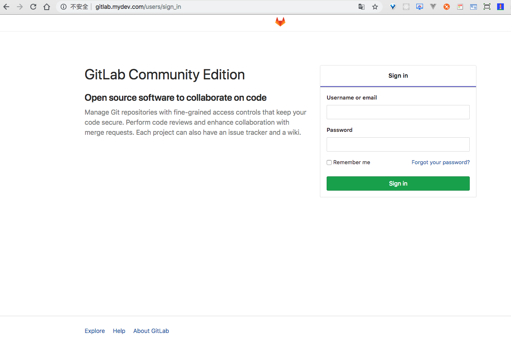

# caltn_docker

Notice: Refer to other people's original version and modify to the version I need
Docker deploying Nginx MySQL PHP Gitlab Postgres in one key.

### Feature
1. Completely open source.
2. Support Multiple PHP version(PHP5.4, PHP5.6, PHP7.2) switch.
3. Support Multiple domains.
4. Support HTTPS and HTTP/2.
5. PHP source located in host.
6. MySQL/Postgres data directory in host.
7. All conf files located in host.
8. All log files located in host.
9. Built-in PHP extensions install commands.
10. Supported any OS with docker.
11. Use docker env file named global project name and nginx dev or prod conf folder name


### Usage
1. Install `git`, `docker` and `docker-compose`;
2. Clone project:
    ```
    $ git clone https://github.com/caltn/caltn_docker
    ```
4. Start docker containers:
    
    first:
    ```
    $ docker-compose -f docker_compose_caltn.yml up -d --build
    ```

    recreate：
    ```
    $ docker-compose -f docker_compose_caltn.yml up -d --build --force-recreate
    ```

    common start/stop:
    ```
    $ docker-compose -f docker_compose_caltn.yml start/stop
    ```
    You may need use `sudo` before this command in Linux.
5. To preview them, add 2 lines to your hosts file (at `/etc/hosts` on Linux and `C:\Windows\System32\drivers\etc\hosts` on Windows):
    ```
    127.0.0.1 site1-local.mydev.com
    127.0.0.1 site2-local.mydev.com
    127.0.0.1 nodejs-local.mydev.com
    127.0.0.1 gitlab-local.mydev.com
    ```
    Then you can visit from browser.
6. Go to your browser and type `http://site1-local.mydev.com`, you will see php72:

7. Go to your browser and type `http://site2-local.mydev.com`, you will see php56:

8. Go to your browser and type `http://nodejs-local.mydev.com`, you will see nodejs:

9. Go to your browser and type `http://gitlab-local.mydev.com`, you will see gitlab:


### Projects
    The project files is located in `./www/`.

### HTTPS and HTTP/2
Default demos:
* http://site1-local.mydev.com
* http://site2-local.mydev.com
* http://nodejs-local.mydev.com
* http://gitlab-local.mydev.com

### Reference resources
- [yeszao/dnmp](https://github.com/yeszao/dnmp)