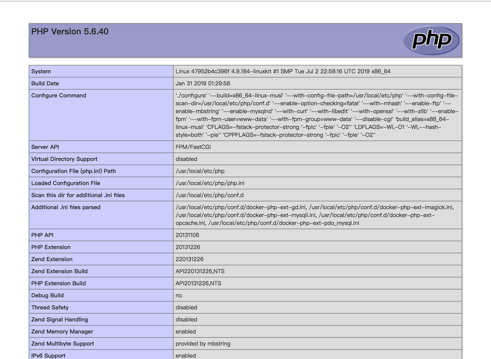
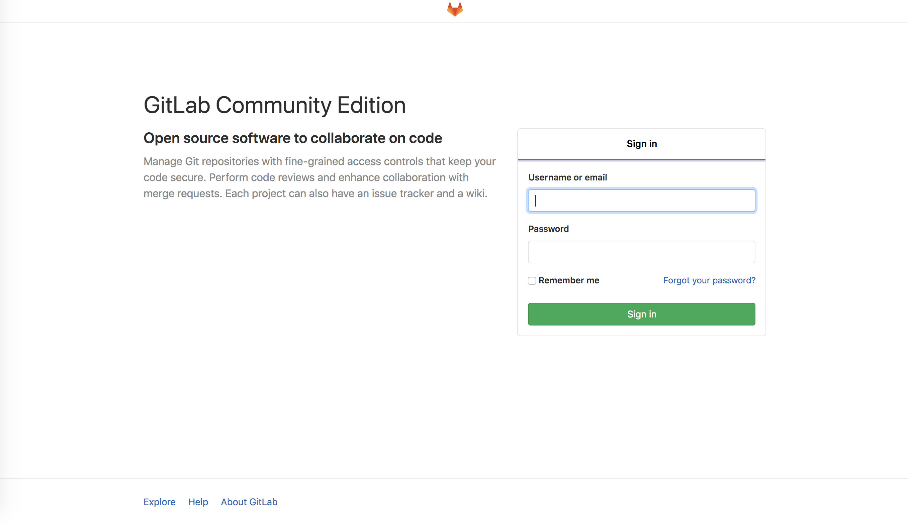

# ec_docker

Notice: Refer to other people's original version and modify to the version I needed.
Docker deploying Caddy Nginx MySQL PHP Gitlab Postgres

### v3 Feature
1. Support Caddy, Nginx server switch.
2. Postgres data directory in host.
3. Use docker env file named global project name, nginx dev or prod config folder name and caddy config folder
4. User `make` command to operate.

### v2 Feature
1. Support Nginx server.
2. Support Multiple domains.
3. Support HTTPS and HTTP/2.
4. Supported any OS with docker.
5. Support Multiple PHP version(PHP5.6, PHP7.2) switch.
6. PHP source located in host.
7. Built-in PHP extensions install commands.
8. MySQL data directory in host.
9. All conf files located in host.
10. All log files located in host.

### Usage
1. Install `git`, `docker` and `docker-compose`;
2. Clone project:
    ```
    $ git clone https://github.com/caltn/ec_docker
    ```
4. Start docker containers:
    
    first:
    ```
    make export_config_caddy (or export_config_nginx)
    ```

    recreate：
    ```
    make dev_caddy (or dev_nginx)
    ```

    common stop/start/restart:
    ```
    make stop (or start, restart)
    ```
    You may need use `sudo` before this command in Linux.
5. To preview them, add 2 lines to your hosts file (at `/etc/hosts` on Linux and `C:\Windows\System32\drivers\etc\hosts` on Windows):
    ```
    127.0.0.1 site1-local.visitor.fun
    127.0.0.1 site2-local.visitor.fun
    127.0.0.1 nodejs-local.visitor.fun
    127.0.0.1 gitlab-local.visitor.fun
    ```
    Then you can visit from browser.
6. Go to your browser and type `http://site1-local.visitor.fun`, you will see php72:

7. Go to your browser and type `http://site2-local.visitor.fun`, you will see php56:

8. Go to your browser and type `http://nodejs-local.visitor.fun`, you will see nodejs:

9. Go to your browser and type `http://gitlab-local.visitor.fun`, you will see gitlab:


### Projects
    The project files is located in `./www/`.

### HTTPS and HTTP/2
Default demos:
* http://site1-local.visitor.fun
* http://site2-local.visitor.fun (caddy server has https)
* http://nodejs-local.visitor.fun (caddy server has https)
* http://gitlab-local.visitor.fun

### Reference resources
- [yeszao/dnmp](https://github.com/yeszao/dnmp)