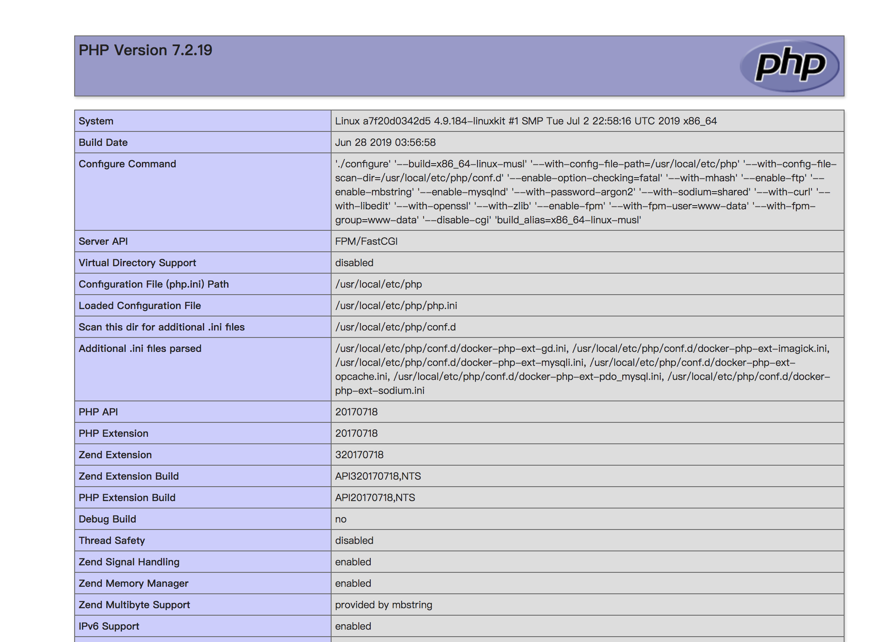
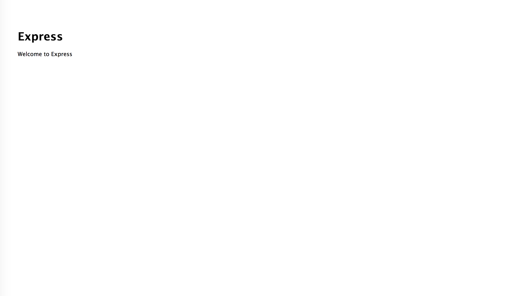

# caltn_docker

Docker deploying Nginx MySQL PHP7 in one key, support full feature functions.


### Feature
1. Completely open source.
2. Support Multiple PHP version(PHP5.4, PHP5.6, PHP7.2) switch.
3. Support Multiple domains.
4. Support HTTPS and HTTP/2.
5. PHP source located in host.
6. MySQL data directory in host.
7. All conf files located in host.
8. All log files located in host.
9. Built-in PHP extensions install commands.
10. Promise 100% available.
11. Supported any OS with docker.

### Usage
1. Install `git`, `docker` and `docker-compose`;
2. Clone project:
    ```
    $ git clone https://github.com/caltn/caltn_docker
    ```
4. Start docker containers:
    ```
    $ docker-compose -f docker_compose_caltn.yml up -d --build --force-recreate
    ```
    You may need use `sudo` before this command in Linux.
5. Go to your browser and type `http://127.0.0.1`, you will see php72:

6. Go to your browser and type `http://127.0.0.1:81`, you will see php56:

7. Go to your browser and type `http://127.0.0.1:90`, you will see nodejs:


The project files is located in `./www/`.

### Other PHP version?
We need not change any other files, such as nginx config file or php.ini, everything will work fine in current environment (except code compatibility error).

> Notice: We can only start one php version, for they using same port. We must STOP the running project then START the other one.

### HTTPS and HTTP/2
Default demo include 3 sites:
* http://www.site1.com (same with http://localhost)
* https://www.site2.com (same with http://localhost:81)
* https://www.nodejs.com (same with http://localhost:90)

To preview them, add 2 lines to your hosts file (at `/etc/hosts` on Linux and `C:\Windows\System32\drivers\etc\hosts` on Windows):
```
127.0.0.1 www.site1.com
127.0.0.1 www.site2.com
127.0.0.1 www.nodejs.com
```
Then you can visit from browser.

### Reference resources
- [yeszao/dnmp](https://github.com/yeszao/dnmp)